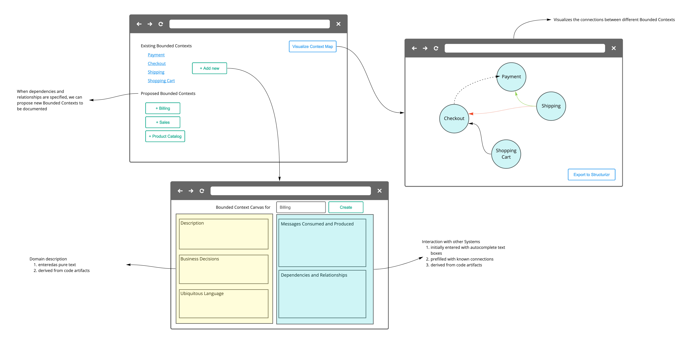

# Building an application

Typically a BCC is created with the help of Post-ITs on physical paper, while digital versions are usually just a mirror of the physical representation, e.g. with the help of Miro.
Meaning that the captured information is represented as free text on virtual Post-ITs and is not stored in a structured way.
This prohibits further data processing and visualization of the information.

Therefor we propose to design a small application which:

- stores information about a BCC in a structured way instead of just using free text on (virtual) Post-ITs,
- allows explicit connections between different bounded contexts,
- supports updating and versioning of the information over time,
- allows to export and visualize the information from the application,
- and helps people to input data for a BCC easier

While capturing the data manually via a form is great for learning, understanding and building up initial representations of BCC.
The manual work can only be seen as a short to mid term goal, in the long run the data for the BCC should be gathered automatically from applications and should then be presented to the user.
E.g. the data can be read from the source code during the build process:

- capturing domain terminology by looking at frequently used words,
- reading business rules & policies from e.g. attributed types,
- discovering dependencies to other systems via e.g. OpenAPI documents or
- describing model traits or classifications via attributes

Additional ideas on how to gather or present information can be read in [Cyrille Martraire book on Living Documentation](https://leanpub.com/livingdocumentation).

## Goals for a Prototype

At the moment we have the following goals we like to reach with Contexture:

- [Mimicking the BCC with HTML forms](https://github.com/Softwarepark/Contexture/milestone/1)
- [Improving data quality](https://github.com/Softwarepark/Contexture/milestone/2)
- [Connecting existing Tools for visualization](https://github.com/Softwarepark/Contexture/milestone/3)
- [Empower users to input data and document their landscape](https://github.com/Softwarepark/Contexture/milestone/4)
- [Provide documentation and samples](https://github.com/Softwarepark/Contexture/milestone/5)
- [Provide a technical perspective](https://github.com/Softwarepark/Contexture/milestone/6)

## Roadmap to a Prototype

- No tests needed
- No deployment needed (local/dev dependencies should be dockerized?)
- No authentication/authorization
- File based persistence is good enough
- No versioning needed
